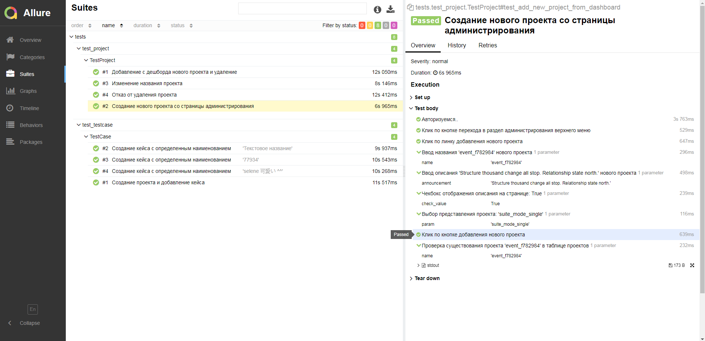

# Demo: End-to-end tests with Selene (Selenium WebDriver)

Project to showcase how to do E2E testing using Python&Selene (page object pattern). For demonstration use TMS [TestRail](https://www.gurock.com/testrail).



## Run testing

```pytest ./tests --alluredir=c:\allure-result```

## Requirements

  - [selene](https://github.com/yashaka/selene)
  - [webdriver_manager](https://github.com/SergeyPirogov/webdriver_manager)
  - [allure-python](https://github.com/allure-framework/allure-python)
  - [faker](https://github.com/joke2k/faker)
  - other requirements you can see in requirements.txt